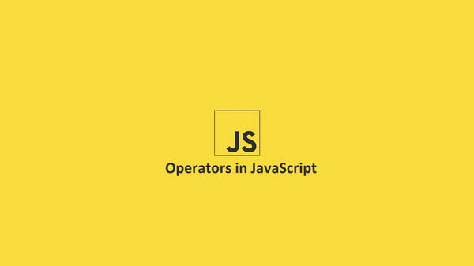

## 1. Toán Tử



### 1.1 Toán tử là gì?

Toán tử trong ngôn ngữ lập trình là các ký hiệu (đôi khi cũng là tên)
được sử dụng để thực hiện các hành động nhất định trên **các đối
số** được gọi là **toán hạng** .

Toán hạng có thể là cả giá trị và biến. Chúng ta đã gặp toán tử nhiều
lần trong các ví dụ trước, ví dụ, ký hiệu gán `=` hoặc từ khóa loại của.

Toán tử có thể được phân loại theo nhiều cách. Ví dụ, chúng được phân
biệt theo số lượng toán hạng mà chúng xử lý.

Toán tử cộng `+` là một **toán tử nhị phân điển** hình (nó sử dụng hai toán
hạng), trong khiloại củatoán tử là **toán tử đơn ngôi** (chỉ sử dụng một
toán hạng).

Trong JavaScript, cũng có một **toán tử ba ngôi** (hoạt động trên ba
toán hạng), chúng ta sẽ nói sơ qua về toán tử này sau.

Chúng ta có thể phân biệt giữa **toán tử tiền tố** (xảy ra trước toán
hạng), **toán tử hậu tố** (sau toán hạng) và **toán tử trung tố** (giữa
các toán hạng). Tuy nhiên, việc phân loại toán tử theo ngữ cảnh sử dụng
là phổ biến: ví dụ, chúng ta có **toán tử gán; toán tử số học; toán tử
logic;** hoặc **toán tử điều kiện** . Chúng ta sẽ xem xét thêm các toán
tử JavaScript cơ bản theo cách phân loại này.

Cùng một ký hiệu có thể được hiểu là một toán tử khác nhau tùy thuộc vào
ngữ cảnh, tức là thường là tùy thuộc vào loại toán hạng. Trong
JavaScript,+symbol là một ví dụ. Nếu toán hạng là số, việc sử dụng toán
tử này sẽ khiến trình thông dịch tính tổng của chúng (đây là toán tử
cộng, được phân loại là số học). Tuy nhiên, nếu toán hạng là chuỗi, cùng
một symbol sẽ được coi là toán tử nối, và trình thông dịch sẽ cố gắng
nối cả hai chuỗi ký tự.

### 1.2 Toán tử gán

Hãy bắt đầu với các toán tử gán. Trong nhóm này, có các toán tử cho phép
gán giá trị cho các biến và hằng số. Toán tử gán cơ bản là dấu bằng `=`,
mà chúng ta đã thấy nhiều lần trong các ví dụ. Toán tử này gán giá trị
của toán hạng bên phải cho toán hạng bên trái.

```javascript
const name = "Alice";

console.log(name); // -> Alice
```

Nếu có nhiều toán tử gán xuất hiện trong một chuỗi, thứ tự từ phải sang
trái sẽ được áp dụng. Do đó, chuỗi:

```javascript
let year = 2050;

let newYear = year = 2051;

có nghĩa giống như:

let year = 2050;

year = 2051;

let newYear = year;
```

Ngoài toán tử gán cơ bản, còn có các toán tử gán liên quan đến toán tử
số học, logic và chuỗi. Chúng ta sẽ quay lại với chúng khi thảo luận về
các loại toán tử khác.

### 1.3 Toán tử số học

Toán tử số học biểu thị các phép toán và chúng chấp nhận các giá trị số
và biến. Tất cả các toán tử số học, **ngoại trừ phép cộng**, sẽ cố gắng ngầm
chuyển đổi các giá trị sang kiểu Số trước khi thực hiện phép toán.

Toán tử cộng sẽ chuyển đổi mọi thứ thành String nếu bất kỳ toán hạng nào
có kiểu **String**, nếu không, nó sẽ chuyển đổi chúng thành **Number** giống như
các toán tử số học còn lại. Thứ tự các phép toán được tôn trọng trong
JavaScript giống như trong toán học, và chúng ta có thể sử dụng dấu
ngoặc đơn như trong toán học để thay đổi thứ tự phép toán nếu cần.

Nhìn chung, việc sử dụng dấu ngoặc đơn để xác định thứ tự ưu tiên và thứ
tự thực hiện các phép toán là một thói quen tốt, không chỉ riêng phép
tính số học. Thứ tự ưu tiên của các phép toán do trình thông dịch thực
hiện sẽ không phải lúc nào cũng trực quan như thứ tự ưu tiên của các
phép tính số học được biết đến trong toán học.

```javascript
console.log(2 + 2 * 2); // -> 6

console.log(2 + 2 * 2); // -> 6

console.log((2 + 2) * 2); // -> 8
```

Các toán tử số học nhị phân cơ bản là phép cộng `+`, phép trừ `-`, phép
nhân `*`, phép chia `/`, phần dư của phép chia `%` và mũ `**`. Hoạt động
của chúng tương tự như những gì chúng ta biết từ toán học và cách dễ
nhất để theo dõi chúng là sử dụng một ví dụ:

```javascript
const x = 5;

const y = 2;

console.log("addition: ", x + y); // -> 7

console.log("subtraction: ", x - y); // -> 3

console.log("multiplication: ", x * y); // -> 10

console.log("division: ", x / y); // -> 2.5

console.log("division remainder :", x % y); // -> 1

console.log("exponent: ", x ** y); // -> 25
```

### 1.4 Toán tử số học một ngôi

Ngoài ra còn có một số toán tử số học đơn ngôi (hoạt động trên một toán
hạng duy nhất). Trong số đó có phép cộng `+` và trừ `-` người vận hành.

Cả hai toán tử đều chuyển đổi toán hạng thành kiểu Số, trong khi toán tử
trừ còn phủ định nó.

```javascript
let str = "123";

let n1 = +str;

let n2 = -str;

let n3 = -n2;

let n4 = +"abcd";

console.log(`${str} : ${typeof str}`); // -> 123 : string

console.log(`\${n1} : ${typeof n1}`); // -> 123 : number

console.log(`${n2} : ${typeof n2}`); // -> -123 : number

console.log(`${n3} : ${typeof n3}`); // -> 123 : number

console.log(`${n4} : ${typeof n4}`); // -> NaN : number
```

### 1.5 Toán tử tăng và giảm một ngôi

Trong số các toán tử số học, chúng ta cũng có thể sử dụng phép **gia số
đơn** `++` và giảm `--` Toán tử, ở cả phiên bản tiền tố và hậu tố. Chúng
cho phép chúng ta tăng (tăng) hoặc giảm (giảm) giá trị của toán hạng đi

Các toán tử này ở dạng hậu tố (tức là toán tử nằm bên phải toán hạng)
thực hiện phép toán bằng cách thay đổi giá trị của biến, nhưng trả về
giá trị trước khi thay đổi. Phiên bản tiền tố của toán tử (tức là toán
tử được đặt trước toán hạng) thực hiện phép toán và trả về giá trị mới.

**Bảng điều khiển phần cuối** đồng bộ hóa

Điều này xảy ra vì dòng mã:

```javascript
console.log(n1++);
```

được hiểu là:

```javascript
console.log(n1);

n1 = n1 + 1;
```

trong khi dòng:

```javascript
console.log(++n1);
```

có nghĩa giống như:

```javascript
n1 = n1 + 1;

console.log(n1);
```

Hãy nhớ rằng kiểu Số là kiểu **dấu phẩy động**, nghĩa là kết quả của một số
phép toán có thể không chính xác.

```javascript
console.log(0.2 + 0.1); // 0.30000000000000004

console.log(0.2 * 0.1); // 0.020000000000000004

console.log(0.3 / 0.1); // 2.9999999999999996
```

Đây là những hiện vật của phép tính số học dấu phẩy động. Số này sẽ
chính xác với các số nguyên lên đến 252, nhưng phân số có thể không
chính xác bằng, vì nhiều phân số không thể biểu diễn trực tiếp ở định
dạng nhị phân. Chúng ta sẽ thảo luận về cách giảm thiểu vấn đề này ngay
khi giới thiệu các toán tử so sánh.

### 1.6 Toán tử gán hợp chất

**Các toán tử số học nhị phân** có thể được kết hợp với **toán tử
gán** , tạo ra phép gán cộng `+=`, phép trừ `-=`, phép nhân `*=` , phép chia `/=`,
lấy dư `%=` và mũ `**=` .

Mỗi toán tử này lấy một giá trị từ biến cần gán (toán hạng bên trái) và
sửa đổi nó bằng cách thực hiện phép toán số học sử dụng giá trị toán
hạng bên phải. Giá trị mới được gán cho toán hạng bên trái. Ví dụ, đoạn
mã dưới đây:

```javascript
x += 100;
```

có thể được viết dưới dạng:

```javascript
x = x + 100;
```

Do đó, sẽ không khó để hiểu cách hoạt động của ví dụ sau:

```javascript
let x = 10;

x += 2;

console.log(x); // -> 12

x -= 4;

console.log(x); // -> 8

x *= 3;

console.log(x); // -> 24

x = 6;

console.log(x); // -> 4

x **= 3;

console.log(x); // -> 64

x %= 10;

console.log(x); // -> 4
```

### 1.7 Toán tử logic

Các toán tử logic hoạt động với các giá trị kiểu Boolean (`true`
hoặc `false` ). Hiện tại, chúng ta có thể giả định rằng chúng hoạt động
trên các toán hạng thuộc kiểu này và chỉ trả về các giá trị thuộc kiểu
này. JavaScript cung cấp cho chúng ta ba toán tử như vậy:

- một phép nối, tức là phép logic AND (`&&` biểu tượng)

- một giải pháp thay thế, tức là logic OR (ký hiệu `||`)

- một phủ định, tức là logic NOT (ký hiệu `!`)

Ý nghĩa của chúng cũng giống như trong logic toán học, và nếu bạn không
chắc chúng hoạt động như thế nào, cách dễ nhất là giải thích chúng dựa
trên các câu logic.

Hãy bắt đầu với phép nối. Đây là một toán tử nhị phân trả về giá trị
true nếu cả hai toán hạng đều đúng. Sử dụng các câu logic, chúng ta có
thể hình dung một câu bao gồm hai mệnh đề đơn giản được kết nối bằng
toán tử AND, ví dụ:

*London là một thành phố* VÀ _London nằm ở Vương quốc Anh._

Cả hai câu đều đúng trong trường hợp này, và sau khi kết hợp chúng với
AND, một câu cũng đúng sẽ được tạo ra. Nếu bất kỳ câu nào trong số này
sai (hoặc cả hai đều sai), thì toàn bộ câu cũng sẽ sai, ví dụ:

*London là một thành phố* VÀ _London nằm ở Iceland._

Trong mã JavaScript, nó trông đơn giản như thế này:

```javascript
console.log(true && true); // -> true

console.log(true && false); // -> false

console.log(false && true); // -> false

console.log(false && false); // -> false
```

Trong trường hợp một toán tử thay thế cũng là toán tử nhị phân, chỉ cần
một trong hai toán hạng đúng là đủ để toán tử trả về giá trị đúng. Quay
lại ví dụ về các câu logic, hãy sử dụng một câu được tạo thành từ hai
câu lệnh được kết nối bằng toán tử OR, ví dụ:

*London là một thành phố* HOẶC _London nằm ở Iceland._

Câu này có thể trông không được hùng hồn hay hợp lý lắm, nhưng xét về
mặt logic thì nó khá chính xác. Chỉ cần một trong hai mệnh đề đúng là
đủ, thì cả câu cũng đúng. Nếu cả hai mệnh đề đều sai, thì câu cũng sẽ
sai, ví dụ:

*London là một ngôi làng* HOẶC _London nằm ở Iceland._

Hãy kiểm tra xem nó trông như thế nào trong JavaScript:

```javascript
console.log(true || true); // -> true

console.log(true || false); // -> true

console.log(false || true); // -> true

console.log(false || false); // -> false
```

Toán tử phủ định là một toán tử đơn, và nó thay đổi giá trị logic của
toán hạng thành giá trị đối lập của nó, tức là từ false thành true, và
từ true thành false. Sử dụng các câu logic, ta có thể biểu diễn nó với
phép phủ định NOT. Hãy lấy ví dụ một câu đơn giản đúng:

_London là một thành phố._

Bằng cách thêm phủ định vào nó, chúng ta thay đổi giá trị của nó thành
sai:

*London* KHÔNG phải _là một thành phố._

Tương tự như vậy, nó sẽ hoạt động theo chiều ngược lại, biến một câu sai
thành một câu đúng. Trong đoạn mã, nó sẽ trông thậm chí còn đơn giản
hơn:

```javascript
console.log(!true); // -> false

console.log(!false); // -> true
```

Tất nhiên, chúng ta có thể kết nối bao nhiêu toán tử này tùy thích, tạo
ra những "câu" phức tạp hơn. Cũng như trường hợp các toán tử số học,
trình tự các hành động được xác định ở đây. Ưu tiên cao nhất là phủ
định `!`, sau đó kết hợp `&&` và cuối cùng là giải pháp thay thế `||`. Tất
nhiên thứ tự ưu tiên có thể được thay đổi bằng cách sử dụng dấu ngoặc
đơn.

```javascript
const a = false;

const b = true;

const c = false;

const d = true;

console.log((a && b && c) || d); // -> true

console.log(a && b && (c || d)); // -> false
```

### 1.8 Toán tử logic và giá trị không phải Boolean

Miễn là toán hạng thuộc kiểu Boolean, chúng ta có thể dễ dàng thấy kết
quả trả về. Tuy nhiên, các toán tử này cũng có thể được sử dụng với các
kiểu dữ liệu khác nhau. Trường hợp dễ nhất là logic **NOT**. Đầu tiên, toán
hạng được chuyển đổi tạm thời thành giá trị Boolean (theo các quy tắc đã
giải thích trong chương trước) và chỉ sau đó mới được xử lý bằng thao
tác toán tử thích hợp (tức là giá trị **true** được chuyển đổi thành **false**
và ngược lại). Do đó, toán tử _NOT_ sẽ luôn trả về `false` hoặc `true`. Thông
thường, phép phủ định kép được sử dụng để chuyển đổi bất kỳ kiểu dữ liệu
nào sang Boolean.

```javascript
let nr = 0;

let year = 1970;

let name = "Alice";

let empty = "";

console.log(!nr); // -> true

console.log(!year); // -> false

console.log(!name); // -> false

console.log(!empty); // -> true

console.log(!!nr); // -> false

console.log(!!name); // -> true
```

Điều này hơi khác với các toán tử logic nhị phân (ví dụ AND và OR).
Chúng không trả về giá trị Boolean. Thực tế, chúng trả về toán hạng thứ
nhất hoặc thứ hai của toán tử đó. Toán tử AND sẽ trả về toán hạng thứ
nhất nếu nó được đánh giá là false, và toán hạng thứ hai nếu ngược lại.
Toán tử OR sẽ trả về toán hạng thứ nhất nếu nó được đánh giá là true, và
toán hạng thứ hai nếu ngược lại. Đánh giá đơn giản là một nỗ lực để
chuyển đổi một toán hạng thành giá trị Boolean (một lần nữa, theo các
quy tắc đã học ở chương trước).

```javascript
console.log(true && 1991); // -> 1991

console.log(false && 1991); // -> false

console.log(2 && 5); // -> 5

console.log(0 && 5); // -> 0

console.log("Alice" && "Bob"); // -> Bob

console.log("" && "Bob"); // -> empty string

console.log(true || 1991); // -> true

console.log(false || 1991); // -> 1991

console.log(2 || 5); // -> 2

console.log(0 || 5); // -> 5

console.log("Alice" || "Bob"); // -> Alice

console.log("" || "Bob"); // -> Bob
```

Cả hai toán tử đều sử dụng **đánh giá ngắn mạch** .

Vì vậy, nếu toán hạng đầu tiên của `AND` là `false` , nó sẽ được trả lại và
không có kiểm tra nào khác được thực hiện.

Ngược lại, nếu toán hạng đầu tiên của `OR` là `true`, nó sẽ được trả
về và không có kiểm tra nào khác được thực hiện. Điều này giúp tăng tốc
độ thực thi mã, nhưng có một tác dụng phụ có thể thấy trong ví dụ này:

```javascript
let x = 0;

let y = 0;

console.log(x++ && y++); // -> 0

console.log(x); // -> 1

console.log(y); // -> y == 0
```

Hướng dẫn `y++` sẽ không bao giờ được thực hiện, điều này có thể gây nhầm
lẫn.

Toán tử logic thường được sử dụng cùng với **toán tử điều kiện** và đặc
biệt hữu ích trong **các lệnh điều kiện** (ra quyết định) và
trong **vòng lặp** (điều kiện kết thúc vòng lặp). Bạn có thể tìm hiểu về
ứng dụng thực tế của chúng trong các phần về lệnh điều kiện và vòng lặp
vừa được đề cập.

### 1.9 Toán tử gán hợp chất

Giống như các toán tử số học, **các toán tử logic nhị phân** có thể được
sử dụng kết hợp với toán tử gán, tạo ra phép gán logic AND `&& =` và một phép
gán OR logic `|| =`.

Có lẽ bạn sẽ dễ dàng hình dung cách chúng hoạt động. Trong trường hợp
toán tử AND, chúng ta có thể kiểm tra bằng ví dụ sau:

```javascript
let a = true;

console.log(a); // -> true

a &&= false;

console.log(a); // -> false
```

Hướng dẫn `a &&= false` có nghĩa chính xác giống như `a = a && false`.

Chúng ta có thể chuẩn bị một ví dụ tương tự cho phép toán OR:

```javascript
let b = false;

console.log(b); // -> false

b ||= true;

console.log(b); // -> true
```

Lần này, hoạt động `b ||= true` được hiểu là `b = b || true`.

## 2. Chuỗi, so sánh chuỗi và các phép toán khác

### 2.1 Toán tử chuỗi

Toán tử duy nhất trong nhóm này là **phép nối** `+` Toán tử này sẽ chuyển
đổi mọi thứ thành **String** nếu bất kỳ toán hạng nào có kiểu Chuỗi. Cuối
cùng, nó sẽ tạo ra một chuỗi ký tự mới, nối toán hạng bên phải vào cuối
toán hạng bên trái.

```javascript
let greetings = "Hi";

console.log(greetings + " " + "Alice"); // -> Hi Alice*
let sentence = "Happy New Year ";

let newSentence = sentence + 10191;

console.log(newSentence); // -> Happy New Year 10191*
console.log(typeof newSentence); // -> string*
```

#### Toán tử gán hợp chất

Bạn có thể đoán rằng toán tử này cũng có thể được sử dụng kết hợp với
toán tử thay thế. Thao tác của nó rất trực quan nên chúng ta sẽ dừng lại
ở một ví dụ đơn giản:

```javascript
let sentence = "Happy New ";

sentence += "Year ";

sentence += 10191;

console.log(sentence); // -> Happy New Year 10191*
```

### 2.2 Toán tử so sánh

Toán tử so sánh được sử dụng để kiểm tra sự bằng nhau hay bất bằng nhau
của các giá trị. Tất cả các toán tử so sánh đều là nhị phân và đều trả
về một giá trị logic biểu diễn kết quả của phép so sánh. `true`
VẬY hoặc `false`.

Giống như các toán tử khác, JavaScript sẽ cố gắng chuyển đổi các giá trị
đang được so sánh nếu chúng có kiểu dữ liệu khác nhau. Việc kiểm tra
tính bằng nhau, hay giá trị nào lớn hơn, bằng cách sử dụng biểu diễn số,
là hợp lý, và trong hầu hết các trường hợp, JavaScript sẽ chuyển đổi
kiểu dữ liệu thành Số trước khi so sánh. Có hai ngoại lệ cho điều này:
chuỗi và **toán tử đồng nhất (bằng nhau nghiêm ngặt)** . Chuỗi được so
sánh char qua char (chính xác từng ký tự Unicode bằng cách sử dụng giá trị
của chúng).

Để kiểm tra xem các toán hạng có bằng nhau hay không, chúng ta có thể sử
dụng toán tử **đồng nhất (bằng nhau nghiêm ngặt)** `===` hoặc toán
tử **bằng** `==`.

Cách đầu tiên hạn chế hơn và để trả về giá trị true, các toán hạng phải
giống hệt nhau (tức là chúng phải bằng nhau và cùng kiểu).

```javascript
console.log(10 === 5); // -> false
console.log(10 === 10); // -> true
console.log(10 === 10n); // -> false
console.log(10 === "10"); // -> false
console.log("10" === "10"); // -> true
console.log("Alice" === "Bob"); // -> false
console.log(0 === false); //-> false
console.log(undefined === false); // -> false
```

Toán tử bằng yêu cầu chúng chỉ bằng nhau và kiểu dữ liệu của chúng không
được so sánh. Vì vậy, nếu các toán hạng có kiểu dữ liệu khác nhau, trình
thông dịch sẽ cố gắng chuyển đổi chúng thành số, ví dụ: **_False_** sẽ chuyển đổi
thành **_0_**, **_true_** ĐẾN **_1_**, không xác định ĐẾN **_NaN_**,vô giá
trị ĐẾN **_0_**, **_10n_** ĐẾN **_10_** Và **_"123"_** ĐẾN **_123_**, vân vân.

Lưu ý rằng nếu bất kỳ toán hạng nào có **_NaN_** giá trị (hoặc đã được chuyển
đổi thành **_NaN_**, ví dụ với **_undefined_**), toán tử bằng sẽ trả về **_False_**.

```javascript
console.log(10 == 5); // -> false
console.log(10 == 10); // -> true
console.log(10 == 10n); // -> true
console.log(10 == "10"); // -> true
console.log("10" == "10"); // -> true
console.log("Alice" == "Bob"); // -> false
console.log(0 == false); // -> true
console.log(undefined == false); // -> false
console.log(NaN == NaN); // -> false
```

** Hãy nhớ! Sử dụng toán tử danh tính trừ khi bạn cố ý cho phép so sánh
tích cực giữa các kiểu khác nhau. **

Ngoài ra còn có các toán tử bổ sung cho các toán tử vừa trình bày
**_--_** toán tử **không đồng nhất** **_!==_** và toán tử **bất đẳng thức** **_!=_**. Sự trở
lại đầu tiên **true** nếu các toán hạng không giống hệt nhau, nói cách
khác, chúng bằng nhau nhưng có kiểu khác nhau hoặc chúng chỉ đơn giản là
khác nhau. Trả về thứ hai **_true_** nếu các toán hạng khác nhau.

```javascript
console.log(10 !== 5); // -> true
console.log(10 !== 10); // -> false
console.log(10 !== 10n); // -> true
console.log(10 !== "10"); // -> true
console.log("10" !== "10"); // -> false
console.log("Alice" !== "Bob"); // -> true
console.log(0 !== false); // -> true
console.log(undefined !== false); // -> true

console.log(10 != 5); // -> true
console.log(10 != 10); // -> false
console.log(10 != 10n); // -> false
console.log(10 != "10"); // -> false
console.log("10" != "10"); // -> false
console.log("Alice" != "Bob"); // -> true
console.log(0 != false); // -> false
console.log(undefined != false); // -> true
console.log(NaN != NaN); // -> true
```

Chúng tôi cũng có các toán tử cho phép chúng tôi kiểm tra xem một trong
các toán hạng có lớn hơn **_>_**, nhỏ hơn **_<_**, lớn hơn hoặc bằng **_>=_** và nhỏ hơn
hoặc bằng **_<=_**. Các toán tử này có tác dụng với mọi loại toán hạng, nhưng
chỉ nên sử dụng chúng trên các số hoặc giá trị có thể chuyển đổi chính
xác thành số.

```javascript
console.log(10 > 100); // -> false
console.log(101 > 100); // -> true
console.log(101 > "100"); // -> true
console.log(101 < 100); // -> false
console.log(100n < 102); // -> true
console.log("10" < 20n); // -> true
console.log(101 <= 100); // -> false
console.log(10 >= 10n); // -> true
console.log("10" <= 20); // -> true
```

Bạn cũng có thể sử dụng chúng để so sánh các chuỗi không biểu diễn số,
nhưng thuật toán so sánh này khá phức tạp, và bản thân phép so sánh này
không thực sự hữu ích. Để đơn giản hóa, các ký tự riêng lẻ của cả hai
chuỗi được kiểm tra ở cùng một vị trí. Giả định rằng giá trị của các ký
tự riêng lẻ tương ứng với vị trí của chúng trong bảng chữ cái (chữ b có
giá trị cao hơn chữ a). Chữ in hoa có giá trị thấp hơn chữ thường, và
chữ số thậm chí còn có giá trị thấp hơn.

```javascript
console.log("b" > "a"); // -> true
console.log("a" > "B"); // -> true
console.log("B" > "A"); // -> true
console.log("A" > "4"); // -> true
console.log("4" > "1"); // -> true
console.log("ab1" < "ab4"); // -> true
console.log("ab4" < "abA"); // -> true
console.log("abB" < "aba"); // -> true
console.log("aba" < "abb"); // -> true
console.log("ab" < "ab4"); // -> true
```

Lưu ý: biểu tượng `=>` tồn tại trong JavaScript, nhưng không phải là toán
tử `--` chúng ta sử dụng nó trong quá trình xây dựng các hàm mũi tên.

### 2.3 Các nhà điều hành khác

Danh sách các toán tử trong JavaScript dài hơn nhiều, nhưng nhiều toán
tử trong số đó sẽ không thực sự hữu ích ở giai đoạn học này, chẳng hạn
như các toán tử bitwise, hoạt động trên các bit đơn lẻ của toán hạng.
Tuy nhiên, cũng đáng đề cập đến một vài toán tử khác, một số đã xuất
hiện trong các ví dụ trước.

#### 2.3.1 typeof

Chúng tôi đã giới thiệuloại củaToán tử này khi thảo luận về kiểu dữ
liệu. Đây là toán tử một ngôi, kiểm tra kiểu toán hạng (có thể là biến
hoặc số nguyên). Toán tử trả về một chuỗi có tên kiểu, chẳng hạn như
"boolean" hoặc "number".

Nếu bạn muốn làm mới kiến ​​thức về toán tử này, hãy quay lại phần về
kiểu dữ liệu.

```javascript
let year = 10191;

console.log(*typeof* year); // -> number\*

console.log(*typeof* false); // -> boolean\*

```

#### 2.3.2 instanceof

Các trường hợp củaToán tử này xuất hiện khi thảo luận về mảng. Đây là
toán tử nhị phân kiểm tra xem một đối tượng (toán hạng trái) có thuộc
kiểu nào đó (toán hạng phải) hay không. Tùy thuộc vào kết quả kiểm tra,
nó trả về `true` hoặc `false`.

Trong khóa học này, tính hữu ích của toán tử này chỉ giới hạn ở việc
kiểm tra xem một biến có chứa mảng hay không.

```javascript
let names = ["Patti", "Bob"];

let name = names[0];

console.log(names instanceof Array); // -> true
console.log(name instanceof Array); // -> false
```

#### 2.3.3 delete

Đơn vị `delete` Toán tử này được giới thiệu khi thảo luận về các đối tượng.
Nó cho phép bạn xóa một trường đã chọn của đối tượng có tên được chỉ
định bằng một toán hạng.

```javascript
let user = {
  name: "Alice",

  age: 38,
};

console.log(user.age); // -> 38
delete user.age;

console.log(user.age); // -> undefined
```

#### 2.3.4 toán tử 3 ngôi

Toán tử cuối cùng được thảo luận khá bất thường, vì đây là toán tử duy
nhất sử dụng ba toán hạng. Đây là một toán tử điều kiện. Dựa trên giá
trị của toán hạng thứ nhất (true hoặc false), giá trị của toán hạng thứ
hai hoặc thứ ba tương ứng sẽ được trả về. Toán tử này thường được sử
dụng để đặt một trong hai giá trị vào biến tùy thuộc vào một điều kiện
nhất định. Chúng ta sẽ quay lại toán tử này khi thảo luận về toán tử if
có điều kiện, nhưng ở đây chúng tôi chỉ cung cấp một ví dụ đơn giản về
cách sử dụng của nó. Ba toán hạng được phân tách với nhau bằng `?` (toán
hạng thứ nhất cách xa toán hạng thứ hai) và `:` (toán hạng thứ hai cách xa
toán hạng thứ ba).

```javascript
console.log(true ? "Alice" : "Bob"); // -> Alice
console.log(false ? "Alice" : "Bob"); // -> Bob
```

Mỗi toán hạng này có thể là một biểu thức cần được tính toán. Trong ví
dụ sau, toán hạng đầu tiên là phép so sánh hai số bằng toán tử so sánh.
Kết quả của phép so sánh sẽ là false, và toán tử điều kiện (ba ngôi) sẽ
sử dụng kết quả này. Ở đây, chúng ta sẽ đi sâu vào một vấn đề quan trọng
về thứ tự thực hiện và thứ tự ưu tiên của toán tử. Chúng ta sẽ tìm hiểu
thêm về vấn đề này sau.

```javascript
let name = 1 > 2 ? "Alice" : "Bob";

console.log(name); // -> Bob
```

### 2.4 Quyền ưu tiên

Hầu như trong tất cả các ví dụ trình bày thao tác của các toán tử liên
tiếp, chúng ta đều làm theo các hướng dẫn sử dụng một toán tử. Trên thực
tế, thường thì nhiều toán tử được sử dụng đồng thời. Đến đây, một câu
hỏi khá quan trọng được đặt ra: trình thông dịch sẽ thực hiện chúng theo
thứ tự nào? Điều này tất nhiên sẽ ảnh hưởng đến kết quả cuối cùng của
các toán tử, vì vậy cần lưu ý điều này khi viết hướng dẫn.

```javascript
let a = 10;

let b = a + 2 \* 3;

let c = a + 2 < 20 - 15;

console.log(a); // -> 10

console.log(b); // -> 16

console.log(c); // -> false

```

Ở dòng thứ hai của ví dụ (khai báo biến b), các toán tử được thực hiện
theo thứ tự toán học. Đầu tiên, phép nhân được thực hiện, sau đó là phép
cộng, và cuối cùng, giá trị kết quả được gán cho biến. Ở dòng thứ ba
(khai báo biến c), vấn đề trở nên phức tạp hơn một chút. Đầu tiên, tổng
của biến a và số 2 được tính, sau đó là tổng của số 20 và 15, và cả hai
kết quả được so sánh với toán tử logic (nhỏ hơn) và kết quả được đặt vào
biến c.

Trình thông dịch JavaScript sử dụng hai thuộc tính toán tử để xác định
trình tự các phép toán: độ ưu tiên và tính kết hợp. Độ ưu tiên có thể
được coi là một mức độ ưu tiên, với một số phép toán có cùng độ ưu tiên
(ví dụ: phép cộng và phép trừ). Tính kết hợp cho phép bạn chỉ định thứ
tự thực thi nếu có nhiều phép toán có cùng độ ưu tiên nằm cạnh nhau.

Độ ưu tiên có thể được biểu diễn dưới dạng giá trị số - giá trị càng
cao, mức độ ưu tiên của thao tác càng cao. Ví dụ, nếu toán
tử **_OP 1_** có độ ưu tiên nhỏ hơn **_OP 2_** , thì lệnh:

\*a **OP 1\*** \*b **OP 2\*** *c*

sẽ được thực hiện như sau: đầu tiên, **OP 2** sẽ được thực hiện trên các
toán hạng *b* và *c* , sau đó **_OP 1_** sẽ được thực hiện trên toán
hạng trái a và toán hạng phải, kết quả từ **_OP 2._** Vì vậy, lệnh có
thể được trình bày dưới dạng:

\*a **OP 1\*** ( \*b **OP 2\*** *c* )

Nếu chúng ta thực hiện cùng một phép toán (hoặc các phép toán khác nhau
nhưng có cùng độ ưu tiên), trình thông dịch sẽ sử dụng tính kết hợp để
xác định thứ tự của các phép toán. Các toán tử có thể có tính kết hợp
trái (thứ tự từ trái sang phải) hoặc tính kết hợp phải (thứ tự từ phải
sang trái) được chỉ định. Giả sử trong ví dụ của chúng ta, toán tử OP1
có tính kết hợp trái:

\*a **OP 1\*** \*b **OP 2\*** *c*

Trong trường hợp này, thao tác OP1 trên toán hạng a và b sẽ được thực
hiện trước, sau đó là thao tác OP1 thứ hai trên kết quả nhận được và
toán hạng c. Lưu ý rằng chúng ta đang xử lý kết hợp trái, chúng ta có
thể viết lệnh theo dạng sau:

( \*a **OP 1\*** *b* ) **_OP 2_** *c*

Do đó, việc biết không chỉ thứ tự ưu tiên của tất cả các toán tử mà còn
cả tính kết hợp của chúng là điều cần thiết. Điều này có vẻ hơi quá sức,
xét đến số lượng toán tử. May mắn thay, thường thì chỉ cần biết các
thuộc tính của những toán tử cơ bản nhất và sử dụng dấu ngoặc trong
những tình huống khó khăn là đủ. Dấu ngoặc cho phép bạn áp đặt thứ tự
các phép toán, giống như trong toán học. Hãy lưu ý điều này khi xem bảng
bên dưới. Bảng này chứa danh sách các toán tử mà chúng ta đã biết cùng
với thứ tự ưu tiên và tính kết hợp của chúng, vì vậy bảng khá lớn. Bạn
hoàn toàn không cần phải nhớ tất cả mọi thứ nếu có thể sử dụng dấu ngoặc
để nhóm các phép toán.

Mũi tên trong cột liên kết hướng về phía bên phải có nghĩa là liên kết
từ trái sang phải, trong khi hướng về phía đối diện có nghĩa là liên kết
từ phải sang trái.

Viết tắt n/a có nghĩa là không áp dụng, vì trong một số toán tử, thuật
ngữ kết hợp không có nghĩa.

Ngay ở đầu bảng, có ba toán tử có thể cần giải thích thêm:

**Nhóm** chỉ đơn giản là sử dụng dấu ngoặc. Chúng được ưu tiên hơn các
toán tử khác, vì vậy chúng ta có thể sử dụng chúng để buộc việc thực thi
các phép toán được ưu tiên;

**Truy cập trường (truy cập thành viên)** là toán tử được sử dụng trong
ký hiệu dấu chấm, dùng để truy cập một trường đối tượng được chọn. Nó
được ưu tiên hơn các toán tử khác (trừ dấu ngoặc vuông), ví dụ như lệnh:

hãy để x = myObject.test + 10;có nghĩa là giá trị của trường kiểm tra
của đối tượng myObject sẽ được lấy trước, sau đó chúng ta sẽ thêm giá
trị 10 vào trường đó và kết quả sẽ được chuyển đến biến x;

**Thứ tự ưu tiên gọi hàm** cho chúng ta biết rằng nếu chúng ta gọi một
hàm, hành động này sẽ được ưu tiên hơn các thao tác khác, ngoại trừ việc
nhóm trong ngoặc vuông và toán tử truy cập trường (dấu chấm). Vì vậy,
trong ví dụ:

cho `y = 10 + myFunction() ** 2`; myFunction sẽ được gọi đầu tiên, kết
quả trả về của nó sẽ được nâng lên lũy thừa 2 và chỉ sau đó chúng ta mới
thêm 10 vào tổng và lưu kết quả vào biến y.

Tuy nhiên, hãy nhớ rằng nếu bạn có bất kỳ thắc mắc nào, chỉ cần sử dụng
dấu ngoặc để sắp xếp thứ tự ưu tiên của các toán tử được sử dụng. Chúng
cho phép bạn sắp xếp ngay cả những lệnh khó hiểu nhất hiện lên trong
đầu.

```javascript
let a, b;

b = (a = (20 + 20) * 2) > 3 ** 2;

console.log(a); // -> 60
console.log(b); // -> true
```

Việc sử dụng dấu ngoặc đơn không chỉ buộc phải tuân theo thứ tự các hành
động mà còn làm tăng khả năng đọc mã (người đọc mã không cần phải thắc
mắc mã đó sẽ được thực hiện như thế nào và theo thứ tự nào).

Danh sách đầy đủ các toán tử và thuộc tính có thể được tìm thấy
trên **các trang MDN** .
